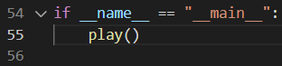

# Impasse Search Engine

This is a search engine for the game [Impasse](https://www.marksteeregames.com/Impasse_rules.pdf) by Mark Steere. It uses Alpha-Beta search along with move ordering, iterative deepening and a transposition table. To play the game, open the play.py file in the Code folder and search for this part at the bottom:

To play an untimed game with human opponents, leave this part as is. To play a timed game against a human opponent (e.g. 10 minutes for each opponent) modify the code by adding the parameter

> secs=600

the call of the play function. To play with an AI opponent as WHITE add the parameter

> ai_player=BLACK

in the call of the play function. Similarly, to play with an AI opponent as BLACK add the parameter

> ai_player=WHITE

Note that you can't play a timed game against the AI. You can undo a move by clicking the z button during gameplay (currently only works for one move). You can start a new game with the same parameters by clicking the n button during gameplay. You can show or hide the cell names by clicking the c button during gameplay.
